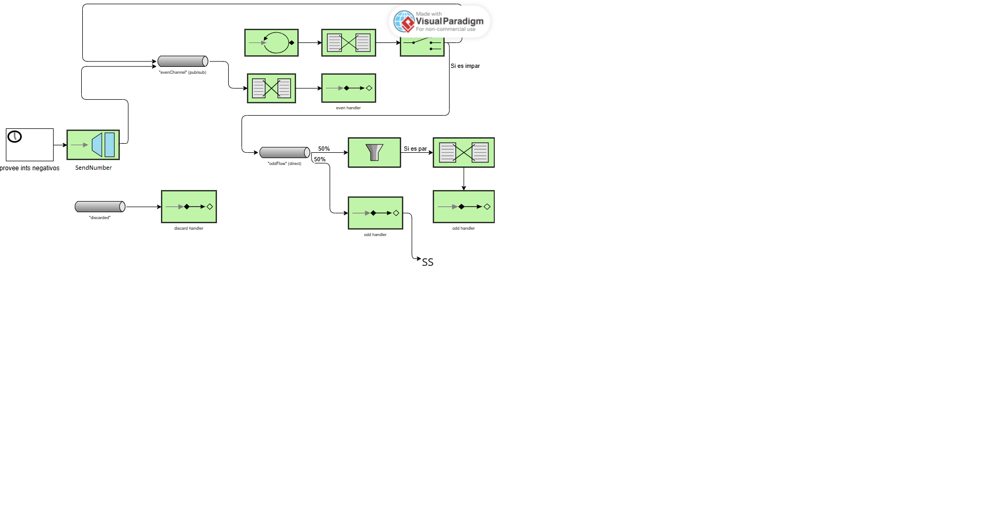

Paula Soriano Sánchez (843710)

# Lab 5 Integration and SOA - Project Report

## 1. EIP Diagram (Before)

The initial code implements a number processing flow using Spring Integration:

### Number Generation

Sequential numbers are generated (integerSource) every 100 ms.
Additionally, negative random numbers are injected via a scheduled gateway.

### Channels and Router

All numbers pass through numberChannel.
A router directs them based on parity: even → evenChannel, odd → oddChannel.

### Processing

evenFlow transforms even numbers to strings and handles them with a logger.
oddFlow transforms filters the numbers, tranforming only even numbers.
SomeService receives all messages from oddChannel.

### Output
Transformed numbers are logged, clearly showing the flow of each number according to its parity and sign.

In summary, the initial flow aimed to separate and process even and odd numbers, but it had issues with filtering and message competition on oddChannel. The way in which those issues were solved is explained in the following section.

---

## 2. What Was Wrong

In this section, I explain the bugs I found in the starter code:

- **Bug 1: wrong filter**
The original filter logic inside oddFlow allowed some even numbers to pass through incorrectly. Specifically, the condition was not correctly identifying odd numbers.

The solution was to change the condition from `p % 2 == 0` to `p % 2 != 0`, ensuring only positive odd numbers are transformed.

- **Bug 2: Gateway apuntando a evenChannel**:
The problem was that the gateway was sending negative numbers to the evenChannel, so those numbers which were impair negatives were considered as pair numbers. This made them skip the filter and the transformer. Firstly, it was thought to make the gateway apuntar to the numberChannel (`@Gateway(requestChannel = "numberChannel")`). However, this idea was discarded because it does not make much sense for the router to evaluate them as pai or impair numbers, as well as to pass through the transformation of the evenChannel if it is a pair negative number. The solution was to make the gateway apuntar to the oddChannel (`@Gateway(requestChannel = "oddChannel")`), so the negative numbers can go directly to the service activator without any unnecessary transformation.

- **Bug 3: oddChannel was a direct channel**:
Both oddFlow and SomeService were subscribed to oddChannel, which was a DirectChannel by default. In DirectChannels, messages are delivered to a single subscriber. This caused some odd numbers to bypass the filter and transformer in oddFlow.

The solution was to change the oddChannel to a PublishSubscribeChannel (`fun oddChannel(): PublishSubscribeChannelSpec<*> = MessageChannels.publishSubscribe()`) so all subscribers receive every message, eliminating the competition issue.

---

## 3. What You Learned

From this lab, I learned:

- How Enterprise Integration Patterns (EIP) such as routing, filtering, and publish-subscribe channels are implemented in Spring Integration.

- The behavior of different channel types: DirectChannel vs. PublishSubscribeChannel and their implications on message delivery.

- How to debug message flows.

A challenging aspect was fixing the competition between subscribers while keeping the flow consistent. The solution was to switch to a PublishSubscribeChannel, allowing all subscribers to process each message.

---

## 4. AI Disclosure

**Did you use AI tools?**
The AI tool was ChatGPT, but only to help improve the clarity and readability of the text, so that external readers can better understand the explanations.

All understanding of the code, the modifications, and the reasoning about message flows and Enterprise Integration Patterns are my own. AI was not used to write or change any code, only to help articulate the report more clearly for others.

## Additional Notes

The questions of phases 1 and 2 of the assignment tasks are answered directly on the code.

---

